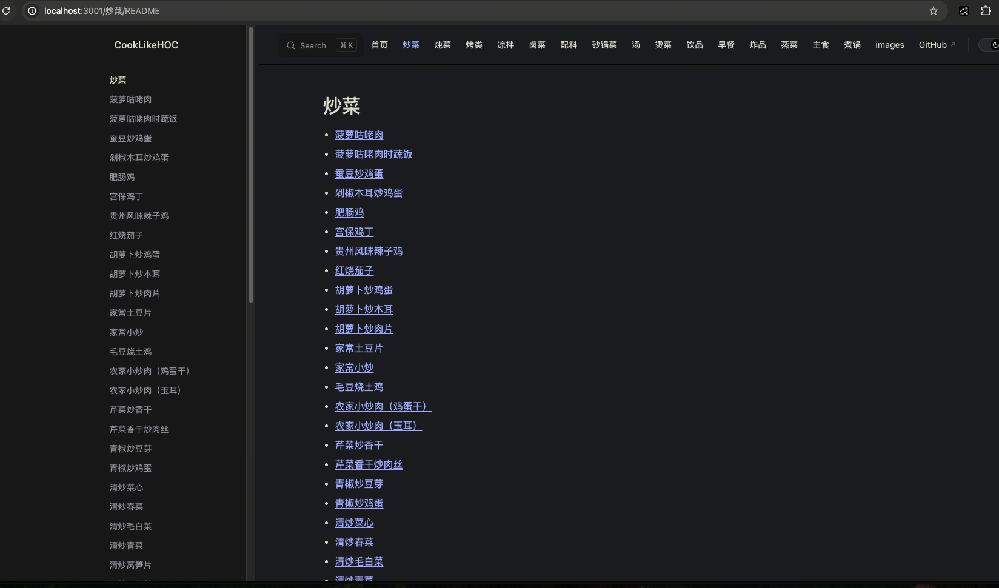
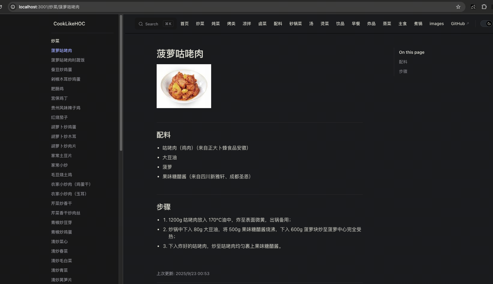
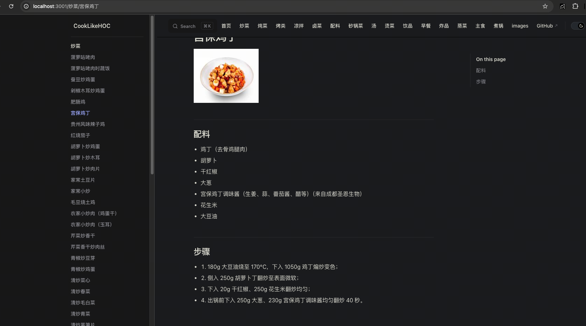

# Docker 打包运行说明

## 环境依赖
- Docker

## 打包
```bash
docker build -t cooklikehoc:0.0.1 -f Dockerfile  .
```

## 运行
```bash
docker run -d --name cooklikehoc \
  -p 3001:80 \
  -e HOST=0.0.0.0 \
  cooklikehoc:0.0.1

# 浏览器访问 http://localhost:3001/  
```

## 效果



