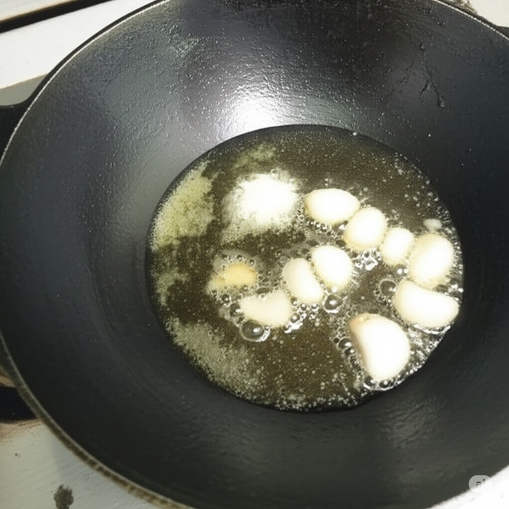
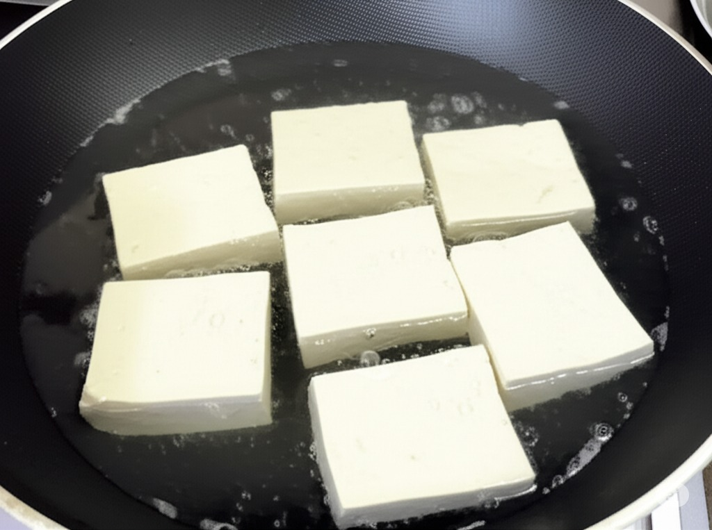
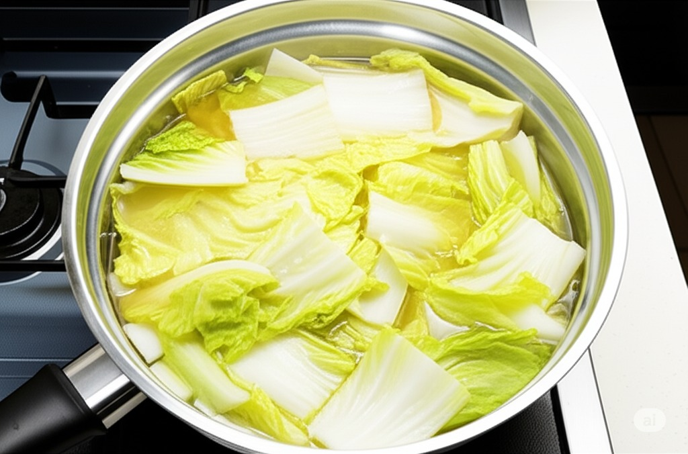

# Tofu stewed with cabbage

> This article is pictured by AI, welcome to contribute real photos.

## raw material:

- Tofu
- Chinese cabbage
- [炒菜基料](/en/配料/炒菜基料.md)
- Cooked lard

## step:

- 1. Add 50g soybean oil, 70g cooked lard, and 30g garlic to stir-fry to bring out the aroma;
     
- 2. Add 900g of water, 1 bag, 3 boxes of tofu, and stew and cook to taste;
     
- 3. Add 800g of cabbage, bring to a boil, turn to low heat, and stew again and add to the flavor.
     
