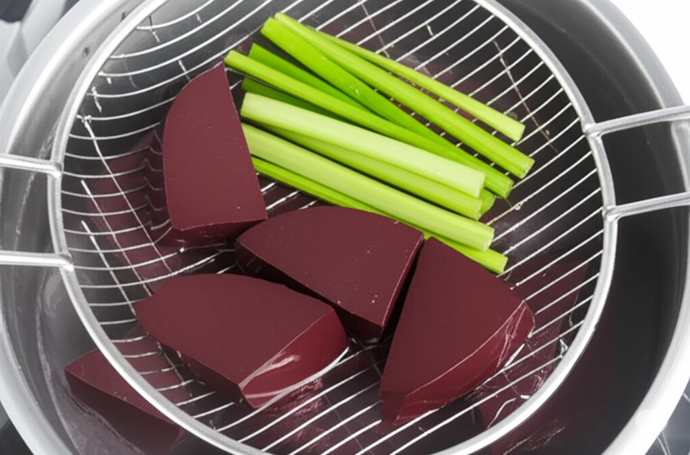
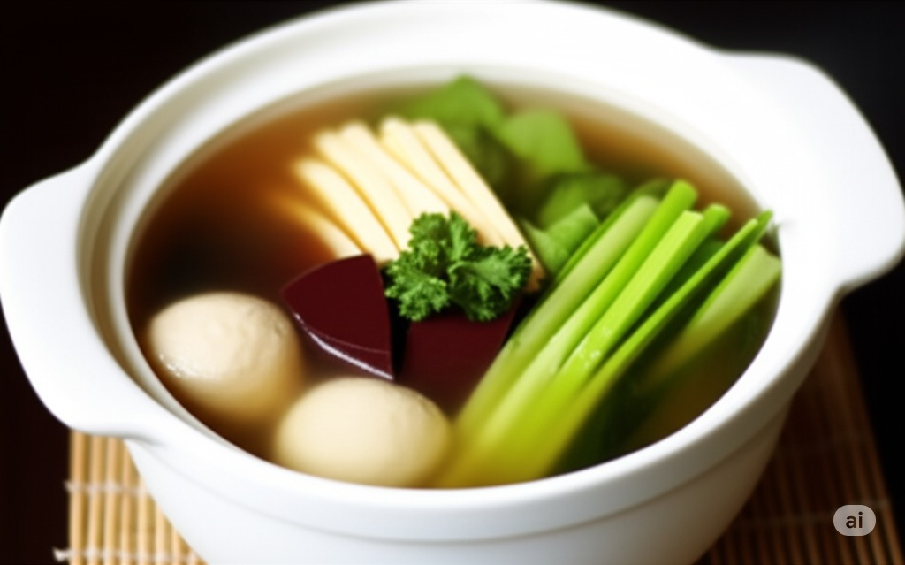

# Chicken Blood Soup

> This article is pictured by AI, welcome to contribute real photos.

## Ingredients

- Chicken blood
- Egg skin
- Green vegetables
- [老鸡汤](/汤/老鸡汤.md)

## step

- Make 30g chicken blood with boiling water for 2 minutes, cool and set aside;
- Take chicken blood, 4g egg skin, 4g green vegetables and boil them for 10 seconds and put them in the soup cup.
  
Add 310g of old chicken soup and garnish with chopped green onion.
  
