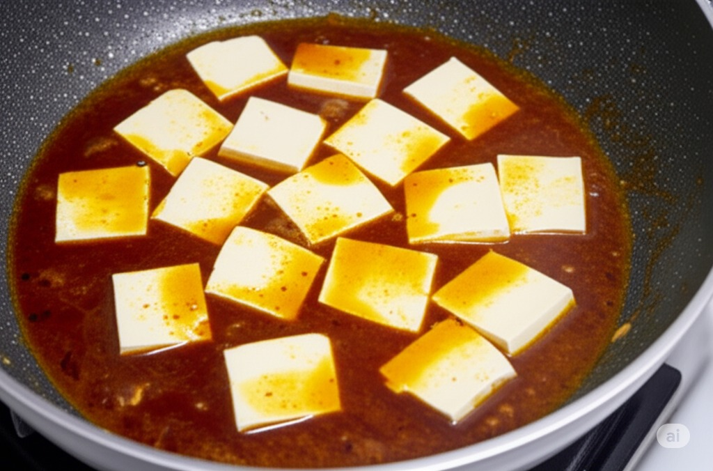

# Mapo tofu

> This article is pictured by AI, welcome to contribute real photos.

## raw material:

- Tofu
- [麻婆豆腐料](/en/配料/麻婆豆腐料.md)
- Corn starch
- Smoked

## step:

- 1. Add 700g of water, 1 bag of Mapo tofu ingredients, 4g of dark soy sauce to boil;
- 2. Add 5 boxes of sliced ​​tofu, bring to a boil and simmer for 3 minutes and 30 seconds;
- 3. Finally add 80g of water starch and cook for 30 seconds to evenly coat the tofu with the soup.
     
