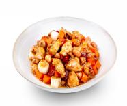

# 宫保鸡丁

## 配料
- 鸡丁（去骨鸡腿肉）
- 胡萝卜
- 干红椒
- 大葱
- 宫保鸡丁调味酱（生姜、蒜、番茄酱、醋等）（来自成都圣恩生物）
- 花生米
- 大豆油

## 步骤
- 1. 180g 大豆油烧至 170℃，下入 1050g 鸡丁煸炒变色；
- 2. 倒入 250g 胡萝卜丁翻炒至表面微软；
- 3. 下入 20g 干红椒、250g 花生米翻炒均匀；
- 4. 出锅前下入 250g 大葱、230g 宫保鸡丁调味酱均匀翻炒 40 秒。

## 营养成分

| 项目 | 每 100g 含量 |
| :--- | :--- |
| 热量 | 244 Kcal |
| 蛋白质 | 13.8 g |
| 脂肪 | 17.2 g |
| 碳水化合物 | 8.7 g |
| 钠 | 657 mg |
