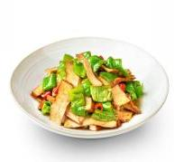

# 小炒香干

## 原料
- 香干
- 大豆油
- 熟猪油
- 蒜子
- 鲜红小米辣
- 青椒
- [炒菜基料](/配料/炒菜基料.md)

## 步骤：
- 1. 下入 100g 大豆油、100g 熟猪油、60g 拍蒜、10g 鲜红小米辣，炒出香味；
- 2. 下入 1900g 香干、炒菜基料 1 袋、400g 青椒，大火爆炒出品。

## 营养成分

| 项目 | 每 100g 含量 |
| :--- | :--- |
| 热量 | 164 Kcal |
| 蛋白质 | 15.4 g |
| 脂肪 | 8.9 g |
| 碳水化合物 | 5.5 g |
| 钠 | 688 mg |
