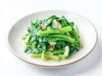

# 清炒春菜

## 原料

- 春菜
- 大豆油
- 熟猪油
- 蒜子
- 盐
- 鸡精
- 白砂糖

## 步骤
- 1.下入 50g 大豆油、100g 熟猪油、70g 蒜子，炒出香味；
- 2. 下入 1700g 春菜、12g 盐、12g 鸡精、4g 白砂糖、100g水，大火爆炒断生出品。

## 营养成分

| 项目 | 每 100g 含量 |
| :--- | :--- |
| 热量 | 36 Kcal |
| 蛋白质 | 1.5 g |
| 脂肪 | 2.1 g |
| 碳水化合物 | 2.9 g |
| 钠 | 337 mg |
