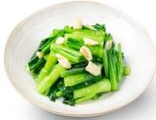

# 清炒菜心

## 原料
- 菜心
- 大豆油
- 熟猪油
- 蒜子
- 鸡精
- 白砂糖
- 盐

## 步骤
- 1. 锅中倒入 100g 大豆油、30g 熟猪油、30g 蒜子，爆出香味
- 2. 下入 1400g 菜心、3g 鸡精、1g 白砂糖、9g 盐，大火爆炒 3 分钟出品。

## 营养成分

| 项目 | 每 100g 含量 |
| :--- | :--- |
| 热量 | 67 Kcal |
| 蛋白质 | 2.5 g |
| 脂肪 | 4.5 g |
| 碳水化合物 | 4.1 g |
| 钠 | 861 mg |
