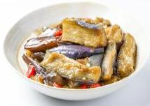

# 红烧茄子

## 配料
- 茄子
- 熟猪油
- 鸡油
- 蒜子
- 剁椒
- [油焖茄子料](/配料/油焖茄子料.md)

## 步骤
- 1. 下入 30g 大豆油、30g 鸡油、100g 蒜子、30g 剁椒，炒出香味；
- 2. 下入 600g 水、油焖茄子料 1 袋、1400g 茄子，炖烧入味出品。

## 营养成分

| 项目 | 每 100g 含量 |
| :--- | :--- |
| 热量 | 106 Kcal |
| 蛋白质 | 1.3 g |
| 脂肪 | 6.2 g |
| 碳水化合物 | 11.2 g |
| 钠 | 532 mg |
