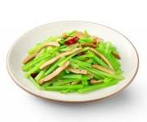

# 芹菜炒香干

## 配料
- 芹菜
- 香干
- 红椒
- 大豆油
- 盐
- 鸡精

## 步骤	
- 下入 120g 大豆油、1100g 芹菜、500g 香干、60g 红椒、15g 盐、10g 鸡精
- 大火爆炒 3 分钟出品。

## 营养成分

| 项目 | 每 100g 含量 |
| :--- | :--- |
| 热量 | 140 Kcal |
| 蛋白质 | 9.5 g |
| 脂肪 | 9.3 g |
| 碳水化合物 | 4.8 g |
| 钠 | 850 mg |
