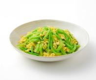

# 莴笋丝炒鸡蛋

## 配料
- 莴笋
- 鸡蛋
- 大豆油
- 盐
- 鸡精

## 步骤
- 1. 锅中倒入 200g 大豆油烧热，将 600g 鸡蛋液炒成鸡蛋片状，盛装出锅备用；
- 2. 锅中下入 50g 大豆油、1300g 莴笋丝、15g 盐、10g 鸡精，大火爆炒至莴笋丝断生；
- 3. 下入鸡蛋片，翻炒均匀出品。

## 营养成分

| 项目 | 每 100g 含量 |
| :--- | :--- |
| 热量 | 144 Kcal |
| 蛋白质 | 4.4 g |
| 脂肪 | 13.5 g |
| 碳水化合物 | 1.7 g |
| 钠 | 665 mg |
