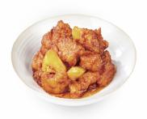

# 菠萝咕咾肉

## 配料
- 咕咾肉（鸡肉）（来自正大卜蜂食品安徽）
- 大豆油
- 菠萝
- 果味糖醋酱（来自四川新雅轩、成都圣恩）

## 步骤
- 1. 1200g 咕咾肉放入 170℃油中，炸至表面微黄，出锅备用；
- 2. 炒锅中下入 80g 大豆油，将 500g 果味糖醋酱烧沸，下入 600g 菠萝块炒至菠萝中心完全受热；
- 3. 下入炸好的咕咾肉，炒至咕咾肉均匀裹上果味糖醋酱。

## 营养成分

| 项目 | 每 100g 含量 |
| :--- | :--- |
| 热量 | 228 Kcal |
| 蛋白质 | 7.2 g |
| 脂肪 | 12.0 g |
| 碳水化合物 | 22.8 g |
| 钠 | 319 mg |
