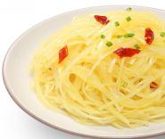

# 酸辣土豆丝

## 配料
- 土豆（黄心）
- 大豆油
- 干红椒
- 盐
- 鸡精
- 白醋

## 步骤
- 1. 将 1800g 土豆丝，在沸水中汆烫 15 秒，捞出备用；
- 2. 下入 160g 大豆油、10g 干红椒，加入焯水后的土豆丝，炒制 1 分钟；
- 3. 下入 18g 盐、10g 鸡精，炒制 1 分 30 秒；
- 4. 下入 22g 白醋，翻炒均匀出品。

## 营养成分

| 项目 | 每 100g 含量 |
| :--- | :--- |
| 热量 | 103 Kcal |
| 蛋白质 | 1.6 g |
| 脂肪 | 5.3 g |
| 碳水化合物 | 12.2 g |
| 钠 | 550 mg |
