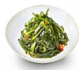

# 酸辣海带丝

## 原料
- 干海带丝
- 大豆油
- 蒜子
- 干红椒
- 剁椒
- 盐
- 鸡精
- 生抽
- 陈醋

## 步骤
- 1. 下入 200g 大豆油、100g 蒜子、7g 干红椒、50g 剁椒，炒出香味；
- 2. 加入 1400g 泡发后的海带丝、10g 盐、10g 鸡精、50g 生抽、40g 陈醋，大火爆炒 2 分钟出品。

## 营养成分

| 项目 | 每 100g 含量 |
| :--- | :--- |
| 热量 | 92 Kcal |
| 蛋白质 | 1.7 g |
| 脂肪 | 7.0 g |
| 碳水化合物 | 5.8 g |
| 钠 | 851 mg |
