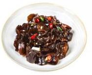
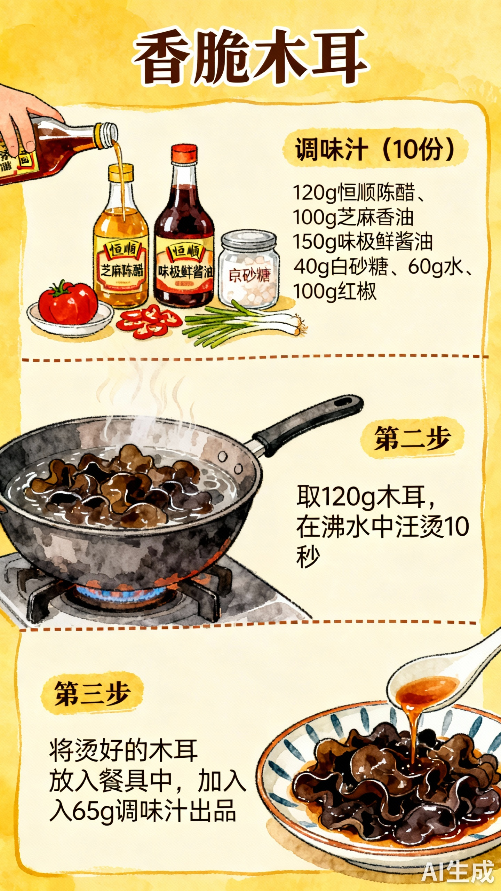

# 香脆木耳

## 配料
- 木耳
- 生抽
- 恒顺陈醋
- 芝麻香油
- 味极鲜酱油
- 红椒
- 京葱
- 白砂糖

## 步骤
- 1. 调味汁（10 份）：120g 恒顺陈醋、100g 芝麻香油、150g 味极鲜酱油、40g 白砂糖、60g 水、100g 红椒、50g 京葱；
- 2. 取 120g 木耳，在沸水中汆烫 10 秒；
- 3. 将烫好的木耳放入餐具中，加入 65g 调味汁出品。

## 手绘制作流程

