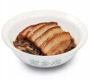
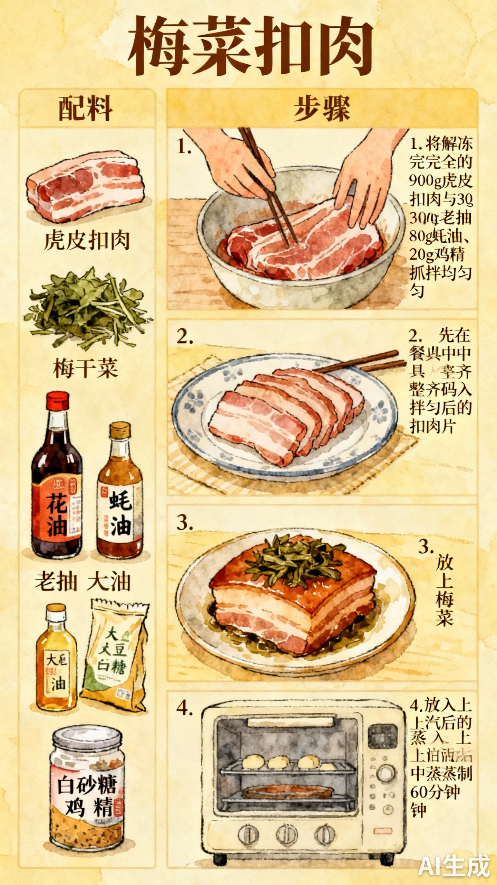

# 梅菜扣肉

## 配料
- 虎皮扣肉（五花肉）（老乡鸡称经由中央厨房清洗、漂烫、过油、卤制、速冻、分切，但未公布具体步骤
- 梅干菜
- 老抽
- 蚝油
- 大豆油
- 白砂糖
- 鸡精

## 步骤
- 1. 将解冻完全的 900g 虎皮扣肉与 30g 老抽、80g 蚝油、20g 鸡精抓拌均匀；
- 2. 先在餐具中整齐码入拌匀后的扣肉片；
- 3. 放上梅菜；
- 4. 放入上汽后的蒸柜中蒸制 60 分钟。

## 手绘制作流程

